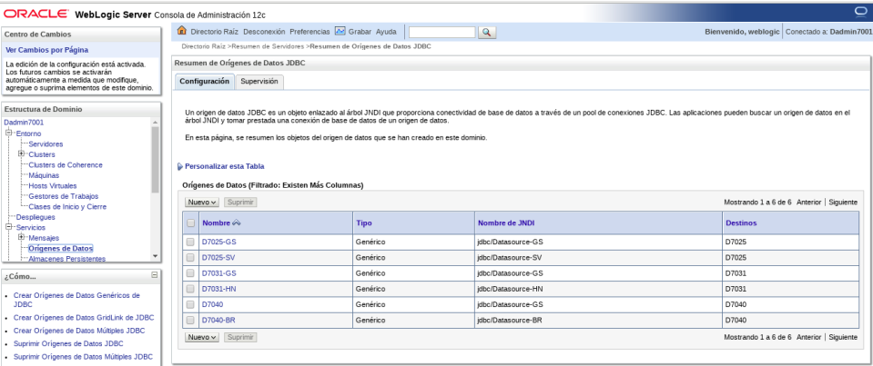

Como iniciar multiples WebLogic Managed Server
================================================

El documento de WebLogic Server recomienda crear un Admin Server dedicado y entonces separar los Managed Server para el despliegue de las  aplicaciones. En este documento mostraremos como crear  varios Managed Server en el mismo servidor srvscm02 con un solo Admin Server.
Debemos tener instalado un WebLogic Server (para tener mas información de como instalarlo puede leer los documentos de instalación de WebLogic de CONSIS).  Despues debemos crear un dominio (para tener mas información de como crearlo puede leer lo documento de Creación de Dominio de CONSIS) y debemos iniciar dicho dominio.

Ahora describimos los paso de forma resumida:
	* Iniciar en el dominio que sera el Admin Server http://srvscm02:7001/console
	* En el árbol de menús a la derecha, hacer click en Environment > Server. Deberia ver “AdminServer(admin)” listo y en Running
	* Click en el botón “New”, colocar el nombre del Managed Server: “D7031” y configuramos el listen del puerto sea: 7031 (Como puede ver, es un dominio con los estándar que CONSIS viene aplicando)
	* Click en el botón “Next” y luego en el “Finish”
	* Ahora abrimos en un nuevo terminal y vamos a realizar la copia del archivo “boot.properties” ubicado en la ruta donde creamos nuestro dominio Admin Server “/u02/app/oracle/domain/Dadmin7001/servers/AdminServer/security/” y lo pegamos en la ruta en donde se creo nuestro Managed Server “/u02/app/oracle/domain/Dadmin7001/servers/D7031/security/”
	* Luego ejecutamos el siguiente comando para iniciar nuestro Managed Server. /u02/app/oracle/domain/Dadmin7001/bin/startManagedWebLogic.sh D7031 192.168.1.54:7001
	Listo…!!!

Usted ahora puede ingresar con el usuario y password, en el Admin Server console, ahí podrá ver el Managed Server Up y Running. Puede comenzar a realizar las creaciones de los Datasource y los Deploy de los EAR.
Las actividades anteriores las puede realizar tantas veces sean necesarias para crear los distintos dominios, se debe tener mucho cuidado con la configuración del JVM del Admin Server

Imágenes del WebLogic con múltiples Managed Server, con sus Datasources y Deploys.

El Admins Server y los Managed Server

Los Datasources.

Los Despliegues.

Ahora vemos las aplicaciones corriendo

