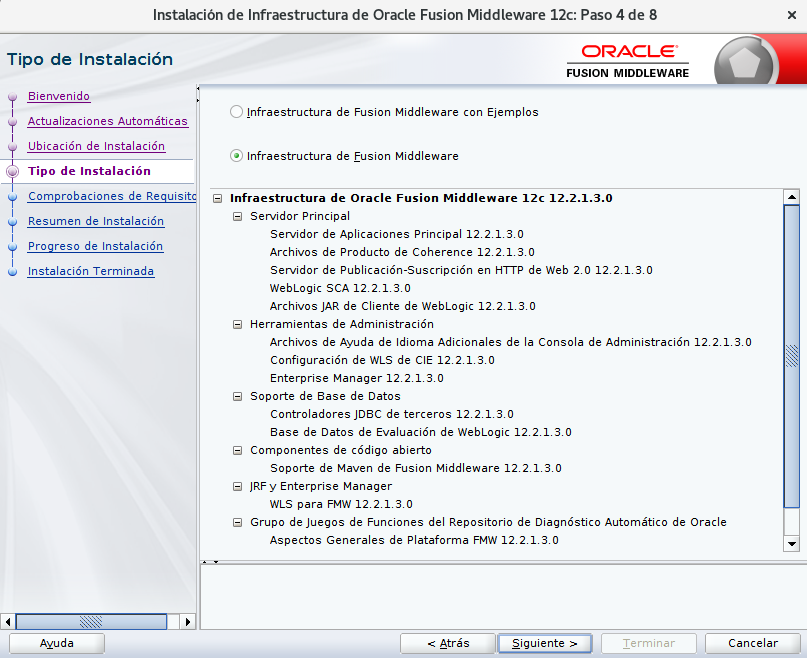

Configuración de un Cluster de Oracle Weblogic 12c
====================================================

Pasos para configurar un Cluster de Weblogic 12c en dos nodos (llamaremos nodos los Equipos Fisicos o Virtuales) para el despliegue de aplicaciones Java EE.

Debe tener:

* JDK instalado configurado JAVA_HOME y el PATH.
* Tener instalado el Weblogic 12.2.1.3.0

Tendremos dos nodos llamados y con la IP:
* appsrv01 - 192.168.1.10
* appsrv01 - 192.168.1.20

Instalación de Weblogic
+++++++++++++++++++++++

Vamos a instalar el Weblogic 12.2.1.3.0 en el servidor appsrv01::

	$ java -jar fmw_12.2.1.3.0_infrastructure.jar

Creamos el Dominio Weblogic::

	$ /uo1/app/Oracle/Middleware/Oracle_Home/oracle_common/common/bin/config.sh

.. figure:: ../images/cluster/03.png

.. figure:: ../images/cluster/20.png

/u01/app/Oracle/Middleware/Oracle_Home/user_projects/domains/base_domain/bin/startWebLogic.sh

/u01/app/Oracle/Middleware/Oracle_Home/user_projects/domains/base_domain/bin/startNodeManager.sh

/u01/app/Oracle/Middleware/Oracle_Home/user_projects/domains/base_domain/bin/startManagedWebLogic.sh webserver1

/u01/app/Oracle/Middleware/Oracle_Home/user_projects/domains/base_domain/bin/startManagedWebLogic.sh webserver2

