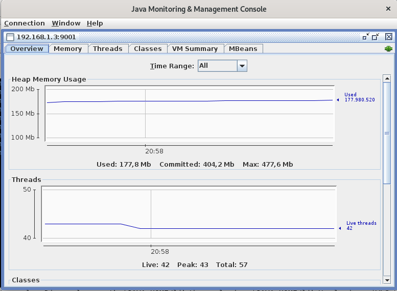

JConsole para monitorear Weblogic Application Server 12c
============================================================

¿Qué es JConsole?
+++++++++++++++++

La interfaz gráfica de usuario de JConsole es una herramienta de monitoreo que cumple con la especificación de Java Management Extensions (JMX). JConsole utiliza la amplia instrumentación de la Máquina virtual Java (Java VM) para proporcionar información sobre el rendimiento y el consumo de recursos de las aplicaciones que se ejecutan en la plataforma Java.

¿Cómo configuro Jconsole con el servidor de aplicaciones weblogic?
+++++++++++++++++++++++++++++++++++++++++++++++++++++++++++++++++++

Supervisión del servidor local:

Establezca el classpath ejecutando setDomainEmv desde <WLS_DOMAIN_HOME>\bin
Inicie Jconsole (como alternativa, puede ejecutarlo desde la ruta absoluta
Seleccione la instancia de Weblogic Server de la lista de procesos locales.

Supervise los detalles esenciales del servidor:

Monitoreo remoto del servidor utilizando JConsole:
++++++++++++++++++++++++++++++++++++++++++++++++++++

1. Actualice setDomainEnv con los siguientes parámetros en JAVA_OPTIONS y reinicie el servidor Weblogic
Para usuarios no autenticados y mecanismos no SSL::

	-Dcom.sun.management.jmxremote
	-Dcom.sun.management.jmxremote.port=9001
	-Dcom.sun.management.jmxremote.ssl=false
	-Dcom.sun.management.jmxremote.authenticate=false

 

Para el mecanismo SSL autenticado:
++++++++++++++++++++++++++++++++++++
::

	-Dcom.sun.management.jmxremote.ssl=true
	-Dcom.sun.management.jmxremote.password.file=jmxremote.password
	-Djavax.net.ssl.keyStore=/home/user/.keystore
	-Djavax.net.ssl.keyStorePassword=myKeyStorePassword
	-Dcom.sun.management.jmxremote.ssl.need.client.auth=true
	-Djavax.net.ssl.trustStore=/home/user/.truststore
	-Djavax.net.ssl.trustStorePassword=myTrustStorePassword
	-Dcom.sun.management.jmxremote.registry.ssl=true

2. Establezca el classpath e inicie JConsole
::

	jconsole -J-Djava.class.path=$JAVA_HOME/lib/jconsole.jar:$JAVA_HOME/lib/tools.jar:$WL_HOME/server/lib/wljmxclient.jar -J-Djmx.remote.protocol.provider.pkgs=weblogic.management.remote -debug

3. Conéctese utilizando el nombre de host y el puerto

Tendrá acceso a todos los detalles de la JVM remota

Para acceder solo a los MBeans:
++++++++++++++++++++++++++++++++

Si desea conectarse solo a JMX MBeans, siga los pasos a continuación:

1. Inicie sesión en la Consola de administración de Weblogic y navegue hasta el servidor que necesita ser monitoreado, configure el nombre de usuario/contraseña para los protocolos IIOP. (Para este ejemplo vamos con el AdminServer)

Nota: reinicie el servidor designado

2. Establezca el classpath e inicie JConsole.

Debe estar seguro de las variables de entorno::

	$ echo $JAVA_HOME
	/usr/lib/jvm/jdk1.8.0_151
	$ echo $WL_HOME
	/home/cgomez/Oracle/Middleware/12.2.1.3/wlserver

	jconsole -J-Djava.class.path=$JAVA_HOME/lib/jconsole.jar:$JAVA_HOME/lib/tools.jar:$WL_HOME/server/lib/wljmxclient.jar -J-Djmx.remote.protocol.provider.pkgs=weblogic.management.remote -debug

3. Conéctese al servidor Mbeans usando la URL del servicio como se muestra a continuación:
::

service:jmx:rmi:///jndi/iiop://192.168.1.3:7001/weblogic.management.mbeanservers.domainruntime

Nota: No vería otros detalles de JVM sino solo los MBeans de tiempo de ejecución del dominio

service:jmx:iiop://140.87.10.42:12565/jndi/weblogic.management.mbeanservers.runtime
service:jmx:iiop://192.168.1.3:7001/jndi/weblogic.management.mbeanservers.runtime
service:jmx:rmi:///jndi/iiop://192.168.1.3:7001/weblogic.management.mbeanservers.domainruntime
service:jmx:iiop://192.168.1.3:7001/jndi/weblogic.management.mbeanservers.domainruntime

jconsole -Djava.class.path=$JAVA_HOME/lib/jconsole.jar:$JAVA_HOME/lib/tools.jar: $WLS_HOME/server/lib/wlfulclient.jar -Djmx.remote.protocol.provider.pkgs=weblogic.management.remote -debug

jconsole -J-Djava.class.path=$JAVA_HOME/lib/jconsole.jar:$JAVA_HOME/lib/tools.jar:$WL_HOME/server/lib/wljmxclient.jar -J-Djmx.remote.protocol.provider.pkgs=weblogic.management.remote

jconsole -J-Djava.class.path=$JAVA_HOME/lib/jconsole.jar:$JAVA_HOME/lib/tools.jar:$WL_HOME/server/lib/wljmxclient.jar -J-Djmx.remote.protocol.provider.pkgs=weblogic.management.remote -debug

service:jmx:rmi:///jndi/iiop://192.168.1.3:7001/weblogic.management.mbeanservers.domainruntime

