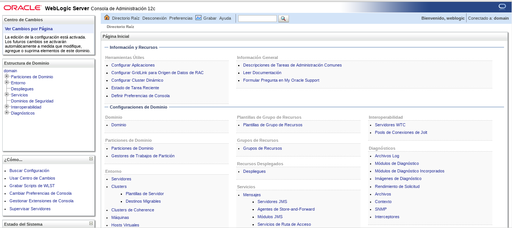
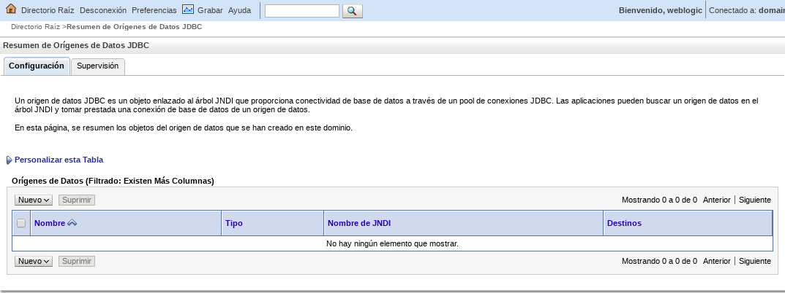

Crear un Datasource
===================

Ingresamos a la consola del Weblogic.:

Nos vamos a Orígenes de Datos

.. figure:: ../images/14.png

Le damos a Nuevo y seleccionamos Origen de Datos Generico

Colocamos nombre desea asignar al nuevo origen de datos JDBC y el nombre JNDI

.. figure:: ../images/16.png

Hacemos seleccion del Driver.

Dejamos esto igual.

Debemos tener a la mano todos los datos de la BD.

Confirma que todos los datos esten bien.

Seleccionamos los Destinos en que se desplegara los Datasource.

Y finiquitamos con exito.

