Crear un Datasource
===================

Lo primero que debemos hacer es descargar el driver **mssql-jdbc-7.0.0.jre8.jar**

Ese driver lo copiamos en el "/u06/app/product/wls12213/wlserver/server/lib/"

Luego debemos editar el **setDomainEnv.sh** y agregarlo en el **CLASSPATH** ::

	CLASSPATH="${CLASSPATH}:/u06/app/product/wls12213/wlserver/server/lib/mssql-jdbc-7.0.0.jre8.jar"

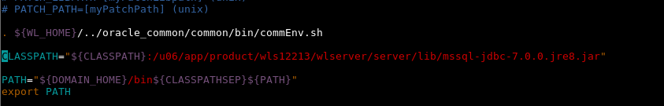

Ingresamos a la consola del Weblogic.:

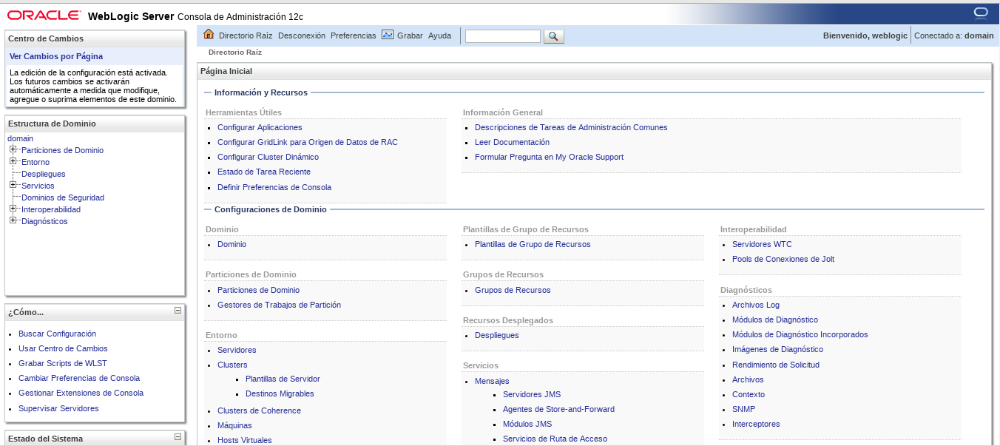

Nos vamos a Orígenes de Datos

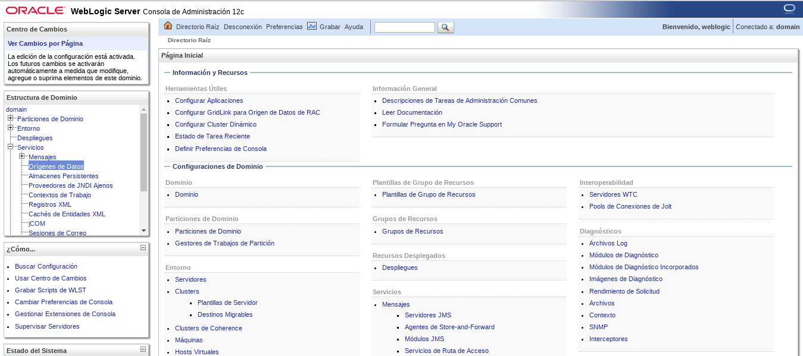

Le damos a Nuevo y seleccionamos Origen de Datos Generico

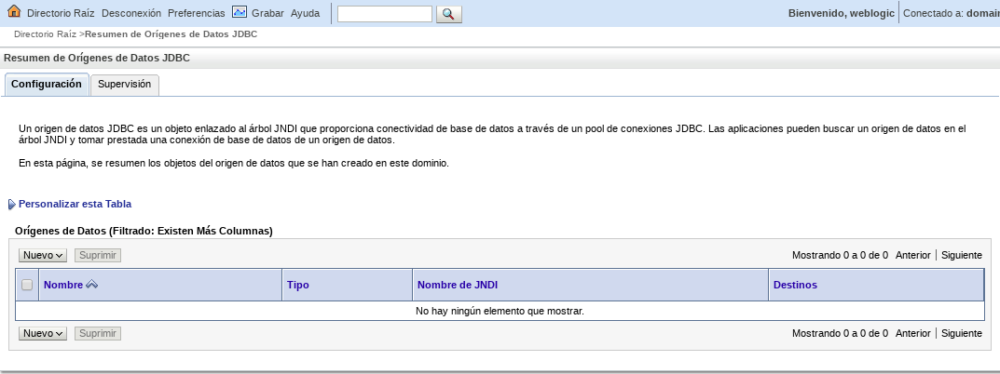

Colocamos nombre desea asignar al nuevo origen de datos JDBC y el nombre JNDI

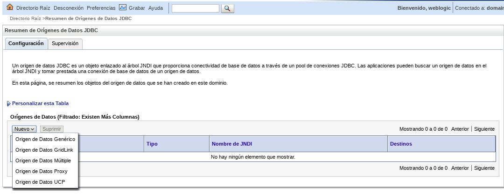

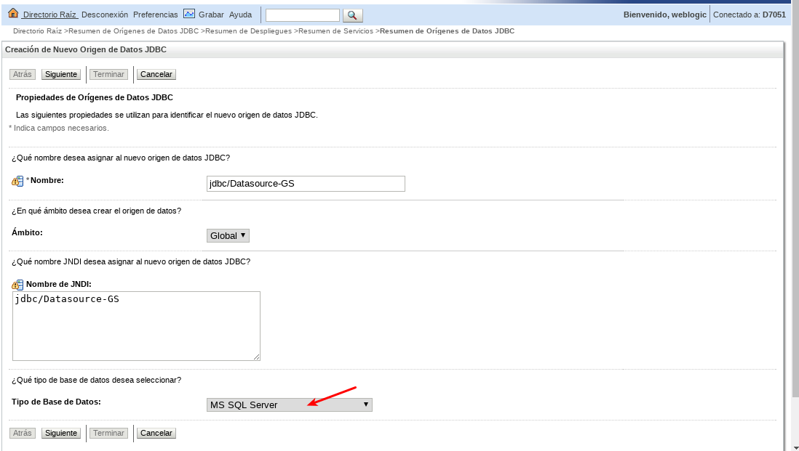

Hacemos seleccion del Driver.

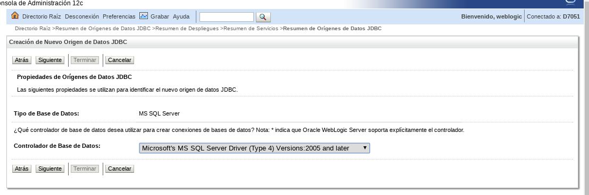

Dejamos esto igual.

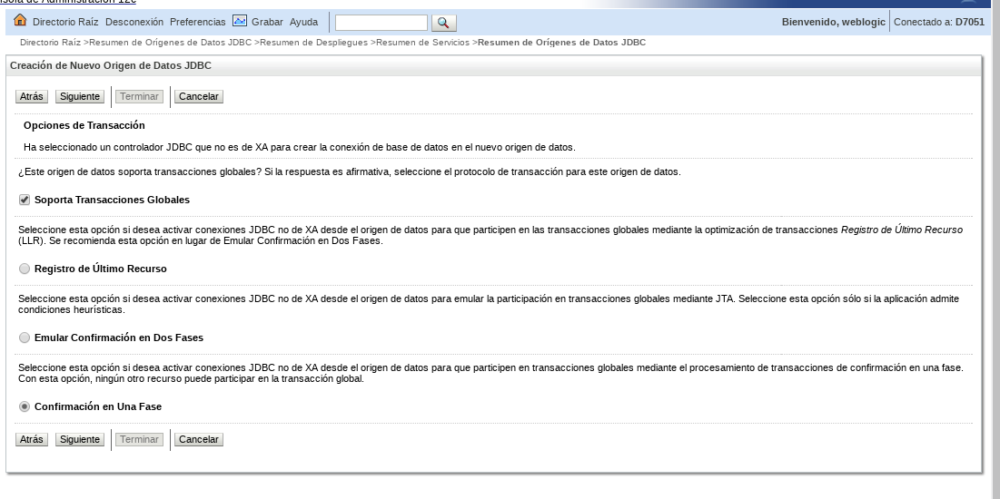

Debemos tener a la mano todos los datos de la BD.

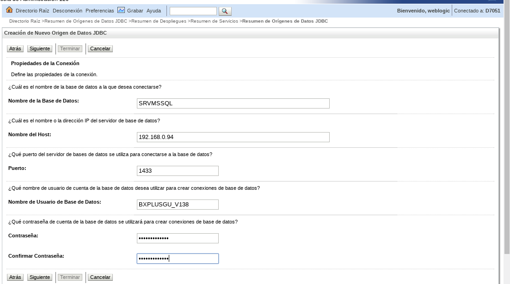

Confirma que todos los datos esten bien.

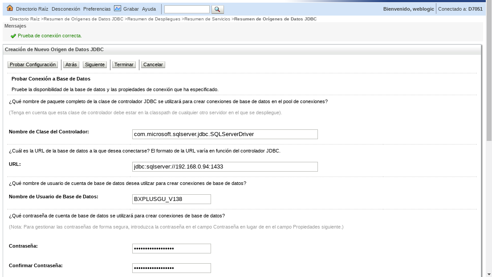

Seleccionamos los Destinos en que se desplegara los Datasource.

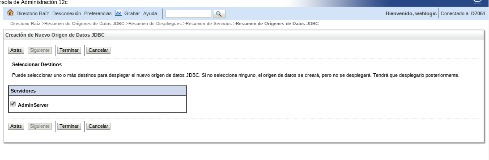

Y finiquitamos con exito.

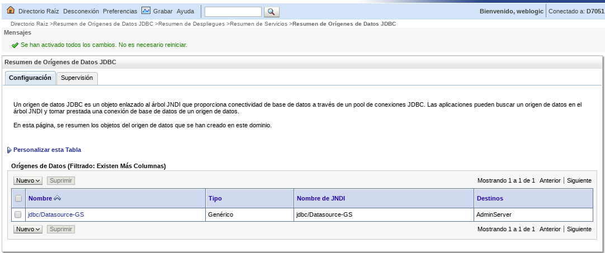

