Crear un Dominio e inicializarlo
================================

Procedemos a iniciar la configuracion de Dominios, recuerde que debe tener configurado el X11.::

	$ /u02/product/Wl_12213/oracle_common/common/bin/config.sh

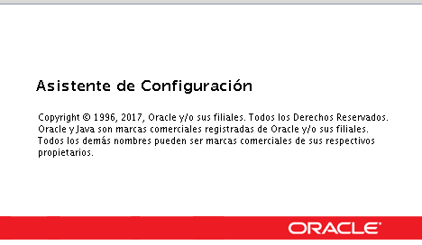

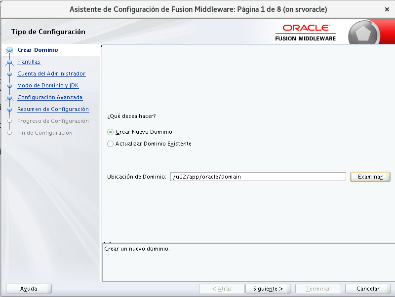

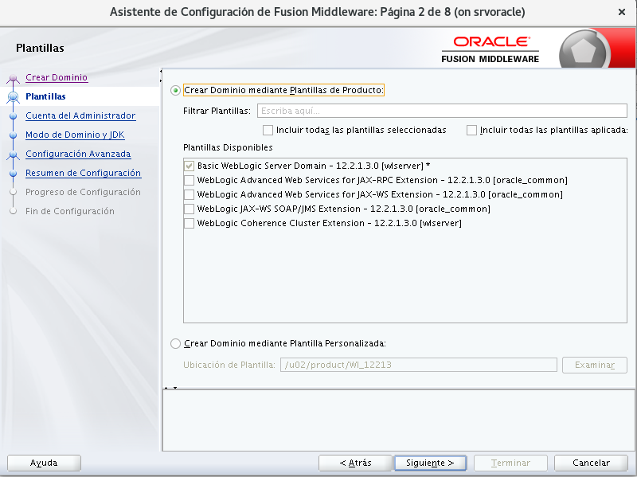

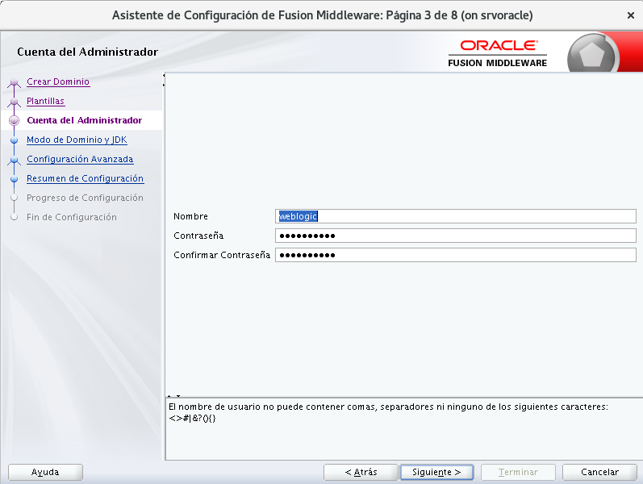

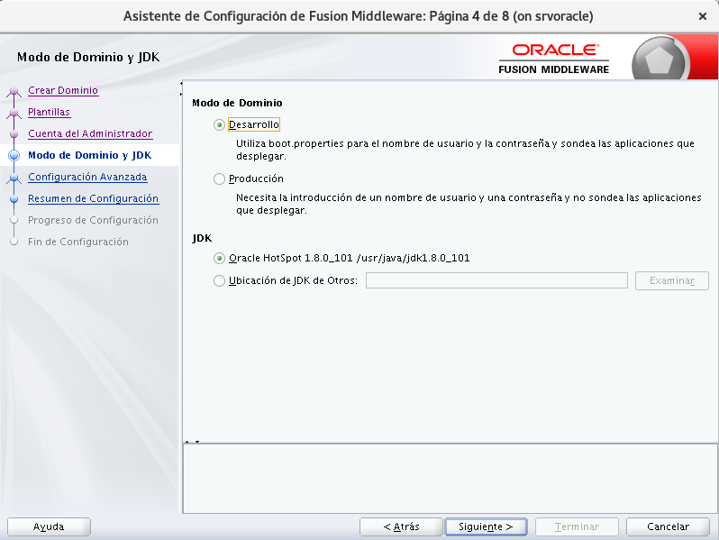

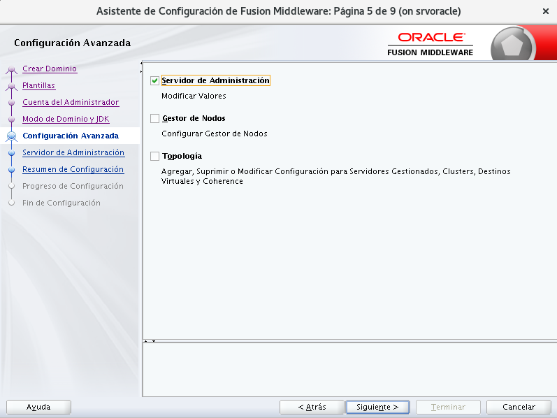

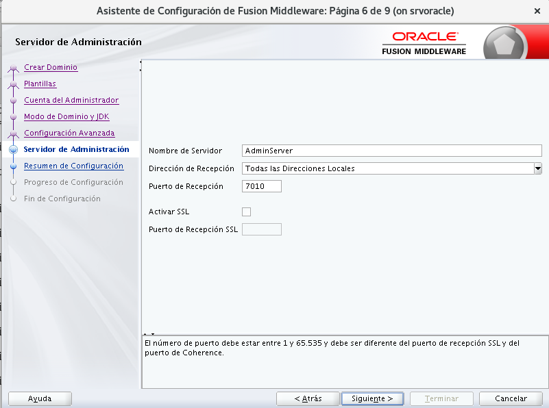

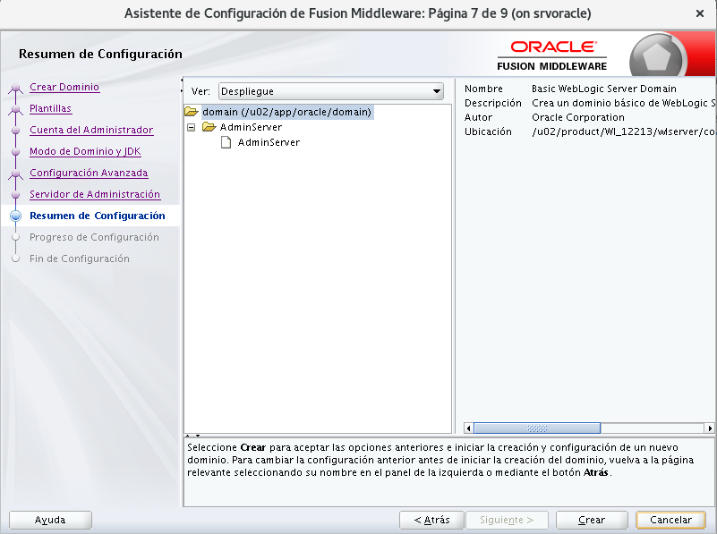

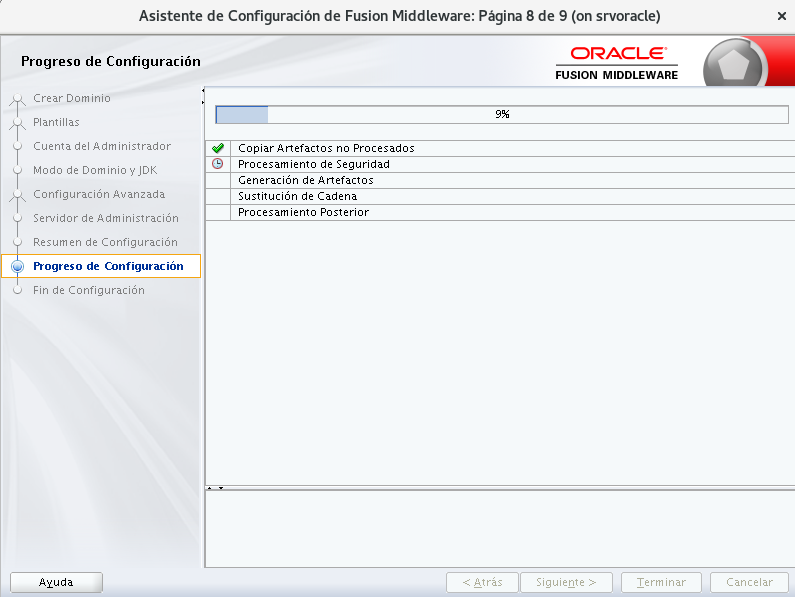

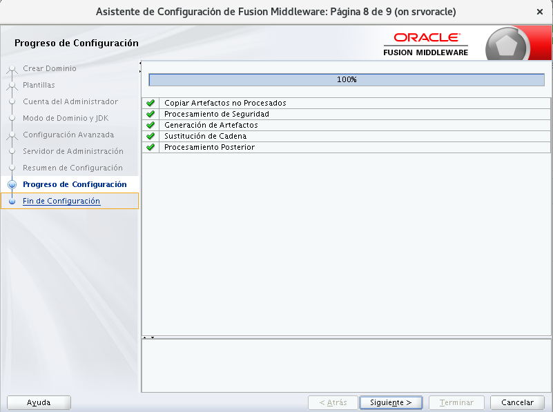

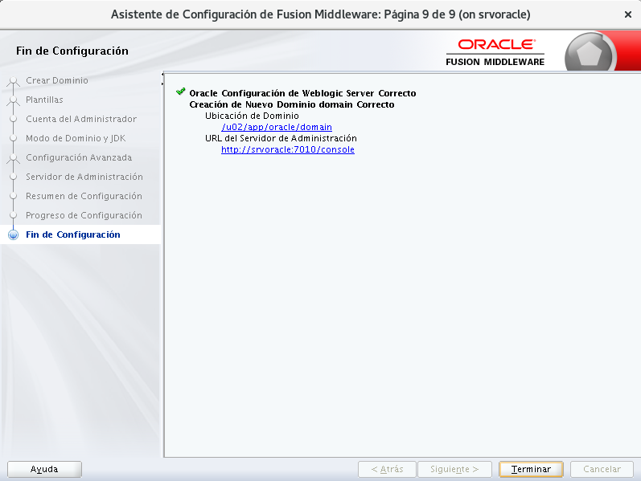

Ya el dominio esta creado ahora lo inicializamos.::

	$ /u02/app/oracle/domain/7010/bin/startWebLogic.sh
		.
		.
		JAVA Memory arguments: -Xms256m -Xmx512m -XX:CompileThreshold=8000
		.
		CLASSPATH=/usr/java/jdk1.8.0_101/lib/tools.jar:/u02/product/Wl_12213/wlserver/server/lib/weblogic.jar:/u02/product/Wl_12213/wlserver/../oracle_common/modules/thirdparty/ant-contrib-1.0b3.jar:/u02/product/Wl_12213/wlserver/modules/features/oracle.wls.common.nodemanager.jar::/u02/product/Wl_12213/wlserver/common/derby/lib/derbynet.jar:/u02/product/Wl_12213/wlserver/common/derby/lib/derbyclient.jar:/u02/product/Wl_12213/wlserver/common/derby/lib/derby.jar
		.
		PATH=/u02/app/oracle/domain/bin:/u02/product/Wl_12213/wlserver/server/bin:/u02/product/Wl_12213/wlserver/../oracle_common/modules/thirdparty/org.apache.ant/1.9.8.0.0/apache-ant-1.9.8/bin:/usr/java/jdk1.8.0_101/jre/bin:/usr/java/jdk1.8.0_101/bin:/usr/lib64/qt-3.3/bin:/usr/local/bin:/bin:/usr/bin:/usr/local/sbin:/usr/sbin:/sbin:/home/oracle/bin
		.
		***************************************************
		*  To start WebLogic Server, use a username and   *
		*  password assigned to an admin-level user.  For *
		*  server administration, use the WebLogic Server *
		*  console at http://hostname:port/console        *
		***************************************************
		Starting WLS with line:
		/usr/java/jdk1.8.0_101/bin/java -server   -Xms256m -Xmx512m -XX:CompileThreshold=8000 -cp /u02/product/Wl_12213/wlserver/server/lib/weblogic-launcher.jar -Dlaunch.use.env.classpath=true -Dweblogic.Name=AdminServer -Djava.security.policy=/u02/product/Wl_12213/wlserver/server/lib/weblogic.policy  -Djava.system.class.loader=com.oracle.classloader.weblogic.LaunchClassLoader  -javaagent:/u02/product/Wl_12213/wlserver/server/lib/debugpatch-agent.jar -da -Dwls.home=/u02/product/Wl_12213/wlserver/server -Dweblogic.home=/u02/product/Wl_12213/wlserver/server      weblogic.Server
		<29/12/2017 08:21:55 PM BOT> <Info> <Security> <BEA-090905> <Disabling the CryptoJ JCE Provider self-integrity check for better startup performance. To enable this check, specify -Dweblogic.security.allowCryptoJDefaultJCEVerification=true.> 
		<29/12/2017 08:21:55 PM BOT> <Info> <Security> <BEA-090906> <Changing the default Random Number Generator in RSA CryptoJ from ECDRBG128 to HMACDRBG. To disable this change, specify -Dweblogic.security.allowCryptoJDefaultPRNG=true.> 
		<29/12/2017 08:21:56 PM BOT> <Info> <WebLogicServer> <BEA-000377> <Starting WebLogic Server with Java HotSpot(TM) 64-Bit Server VM Version 25.101-b13 from Oracle Corporation.> 
		<29/12/2017 08:21:57 PM BOT> <Info> <RCM> <BEA-2165021> <"ResourceManagement" is not enabled in this JVM. Enable "ResourceManagement" to use the WebLogic Server "Resource Consumption Management" feature. To enable "ResourceManagement", you must specify the following JVM options in the WebLogic Server instance in which the JVM runs: -XX:+UnlockCommercialFeatures -XX:+ResourceManagement.> 
		<29/12/2017 08:21:57 PM BOT> <Info> <Management> <BEA-141107> <Version: WebLogic Server 12.2.1.3.0 Thu Aug 17 13:39:49 PDT 2017 1882952> 
		<29/12/2017 08:23:34 PM BOT> <Notice> <WebLogicServer> <BEA-000365> <Server state changed to STARTING.> 
		<29/12/2017 08:23:34 PM BOT> <Info> <WorkManager> <BEA-002900> <Initializing self-tuning thread pool.> 
		<29/12/2017 08:23:34 PM BOT> <Info> <WorkManager> <BEA-002942> <CMM memory level becomes 0. Setting standby thread pool size to 256.> 
		<29/12/2017 08:23:36,186 PM BOT> <Notice> <Log Management> <BEA-170019> <The server log file weblogic.logging.FileStreamHandler instance=569778251
		Current log file=/u02/app/oracle/domain/servers/AdminServer/logs/AdminServer.log
		Rotation dir=/u02/app/oracle/domain/servers/AdminServer/logs
		 is opened. All server side log events will be written to this file.> 
		<29/12/2017 08:23:36,722 PM BOT> <Notice> <Security> <BEA-090946> <Security pre-initializing using security realm: myrealm> 
		<29/12/2017 08:26:19,600 PM BOT> <Notice> <Security> <BEA-090947> <Security post-initializing using security realm: myrealm> 
		<29/12/2017 08:26:21,640 PM BOT> <Notice> <Security> <BEA-090082> <Security initialized using administrative security realm: myrealm> 
		<29/12/2017 08:26:22,585 PM BOT> <Notice> <JMX> <BEA-149512> <JMX Connector Server started at service:jmx:iiop://127.0.0.1:7010/jndi/weblogic.management.mbeanservers.runtime.> 

		<29/12/2017 08:31:39,579 PM BOT> <Notice> <JMX> <BEA-149512> <JMX Connector Server started at service:jmx:iiop://127.0.0.1:7010/jndi/weblogic.management.mbeanservers.edit.> 
		<29/12/2017 08:31:39,600 PM BOT> <Notice> <JMX> <BEA-149512> <JMX Connector Server started at service:jmx:iiop://127.0.0.1:7010/jndi/weblogic.management.mbeanservers.domainruntime.> 
<29/12/2017 08:31:41,424 PM BOT> <Notice> <WebLogicServer> <BEA-000365> <Server state changed to STANDBY.> 
<29/12/2017 08:31:41,426 PM BOT> <Notice> <WebLogicServer> <BEA-000365> <Server state changed to STARTING.> 
<29/12/2017 08:31:41,544 PM BOT> <Notice> <Log Management> <BEA-170036> <The Logging monitoring service timer has started to check for logged message counts every 30 seconds.> 
<29/12/2017 08:31:42,493 PM BOT> <Notice> <Log Management> <BEA-170027> <The server has successfully established a connection with the Domain level Diagnostic Service.> 
<29/12/2017 08:31:42,774 PM BOT> <Notice> <WebLogicServer> <BEA-000365> <Server state changed to ADMIN.> 
<29/12/2017 08:31:42,857 PM BOT> <Notice> <WebLogicServer> <BEA-000365> <Server state changed to RESUMING.> 
<29/12/2017 08:31:43,042 PM BOT> <Notice> <Server> <BEA-002613> <Channel "Default[2]" is now listening on 10.0.2.15:7010 for protocols iiop, t3, ldap, snmp, http.> 
<29/12/2017 08:31:43,045 PM BOT> <Warning> <Server> <BEA-002611> <The hostname "localhost", maps to multiple IP addresses: 127.0.0.1, 0:0:0:0:0:0:0:1.> 
<29/12/2017 08:31:43,046 PM BOT> <Notice> <Server> <BEA-002613> <Channel "Default[3]" is now listening on 0:0:0:0:0:0:0:1%lo:7010 for protocols iiop, t3, ldap, snmp, http.> 
<29/12/2017 08:31:43,048 PM BOT> <Notice> <Server> <BEA-002613> <Channel "Default" is now listening on 127.0.0.1:7010 for protocols iiop, t3, ldap, snmp, http.> 
<29/12/2017 08:31:43,052 PM BOT> <Notice> <WebLogicServer> <BEA-000331> <Started the WebLogic Server Administration Server "AdminServer" for domain "domain" running in development mode.> 
<29/12/2017 08:31:43,052 PM BOT> <Notice> <Server> <BEA-002613> <Channel "Default[1]" is now listening on 192.168.56.10:7010 for protocols iiop, t3, ldap, snmp, http.> 
<29/12/2017 08:31:43,053 PM BOT> <Notice> <Server> <BEA-002613> <Channel "Default[2]" is now listening on 10.0.2.15:7010 for protocols iiop, t3, ldap, snmp, http.> 
<29/12/2017 08:31:43,053 PM BOT> <Notice> <Server> <BEA-002613> <Channel "Default[3]" is now listening on 0:0:0:0:0:0:0:1%lo:7010 for protocols iiop, t3, ldap, snmp, http.> 
<29/12/2017 08:31:43,053 PM BOT> <Notice> <Server> <BEA-002613> <Channel "Default" is now listening on 127.0.0.1:7010 for protocols iiop, t3, ldap, snmp, http.> 
<29/12/2017 08:31:43,053 PM BOT> <Notice> <Server> <BEA-002613> <Channel "Default[1]" is now listening on 192.168.56.10:7010 for protocols iiop, t3, ldap, snmp, http.> 
<29/12/2017 08:31:43,078 PM BOT> <Notice> <WebLogicServer> <BEA-000360> <The server started in RUNNING mode.> 
<29/12/2017 08:31:43,126 PM BOT> <Notice> <WebLogicServer> <BEA-000365> <Server state changed to RUNNING.> 

Nos vamos a la URL del servidor para abrir la consola WEB, IP_SERVER:7010/console.::

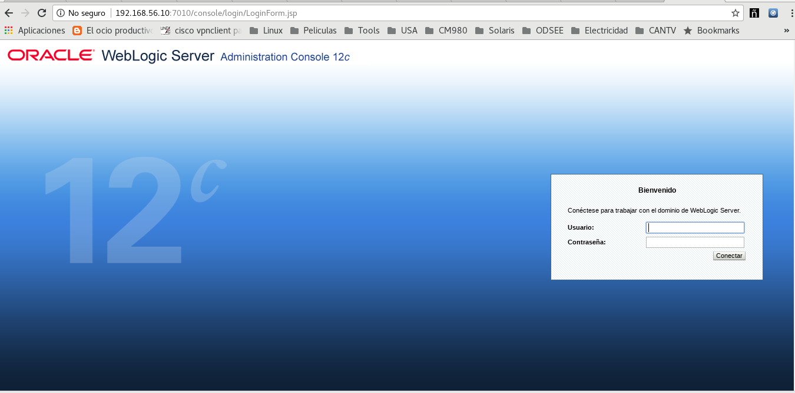

Colocamos el usuario y la clave que creamos en la configuracion del Dominio.

.. figure:: ../images/13.png

