Desplegando una aplicacion
==========================

En scripts tenemos un WAR de ejemplo.

Nos vamos a Despliegues y le damos instalar.

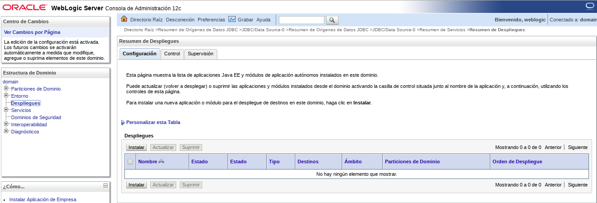

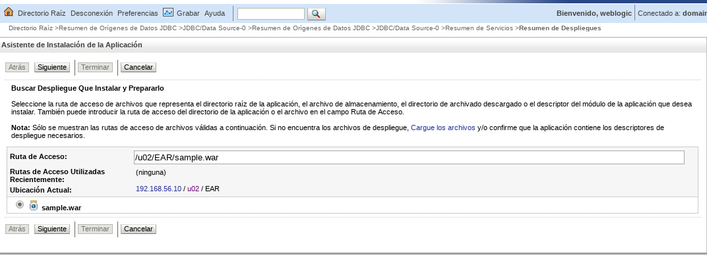

Dejamos Instalar Despliegue como Aplicación

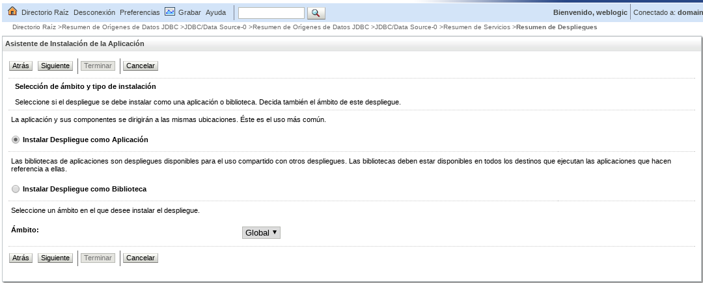

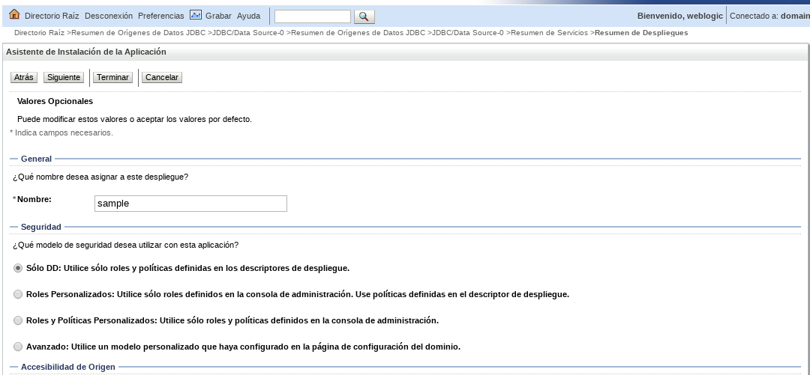

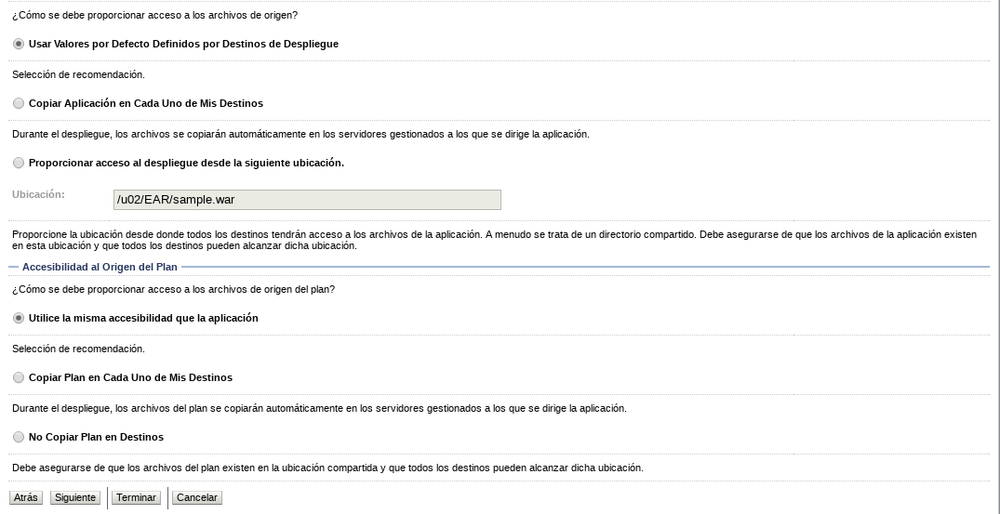

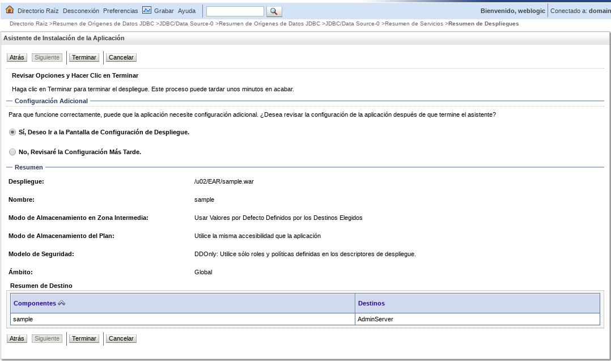

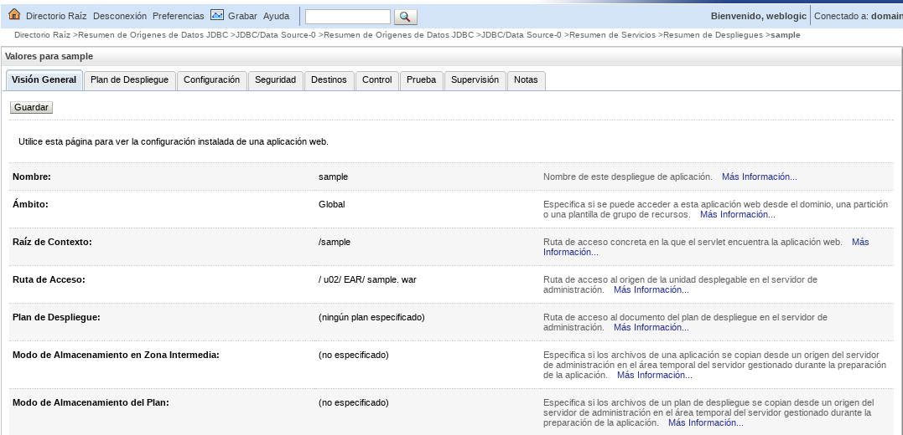
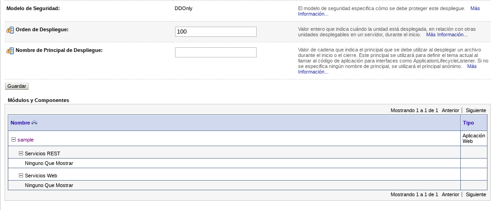

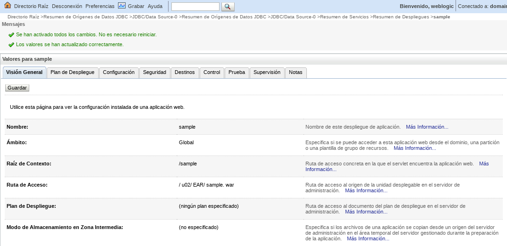
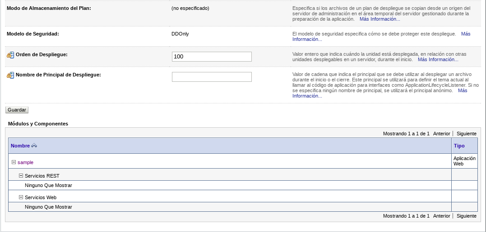

Probamos la aplicacion IP_SERVER:7010/sample

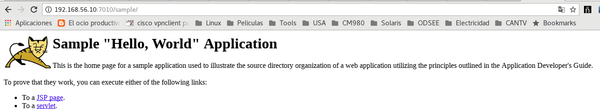

Ahora por consola bash
++++++++++++++++++++++

Eliminamos el desplieque y ahora lo vamos hacer por la consola del bash.

Preparamos el ambiente.::

	$ source /u02/product/Wl_12213/wlserver/server/bin/setWLSEnv.sh 
		CLASSPATH=/usr/java/jdk1.8.0_101/lib/tools.jar:/u02/product/Wl_12213/wlserver/modules/features/wlst.wls.classpath.jar:

		PATH=/u02/product/Wl_12213/wlserver/server/bin:/u02/product/Wl_12213/wlserver/../oracle_common/modules/thirdparty/org.apache.ant/1.9.8.0.0/apache-ant-1.9.8/bin:/usr/java/jdk1.8.0_101/jre/bin:/usr/java/jdk1.8.0_101/bin:/usr/lib64/qt-3.3/bin:/usr/local/bin:/bin:/usr/bin:/usr/local/sbin:/usr/sbin:/sbin:/home/oracle/bin:/u02/product/Wl_12213/wlserver/../oracle_common/modules/org.apache.maven_3.2.5/bin

		Your environment has been set.

Realizamos el despliegue.::

	$ java weblogic.Deployer -adminurl 192.168.56.10:7010/console -username weblogic -password weblogic01 -deploy /u02/EAR/sample.war 
		weblogic.Deployer invoked with options:  -adminurl 192.168.56.10:7010/console -username weblogic -deploy /u02/EAR/sample.war
		<29/12/2017 10:07:22,787 PM BOT> <Notice> <JMX> <BEA-149535> <JMX Resiliency Activity Server=AdminServer : Initializing callbacks> 
		<29/12/2017 10:07:22,815 PM BOT> <Notice> <JMX> <BEA-149535> <JMX Resiliency Activity Server=AdminServer : Added MBeanServerConnection in DomainRuntimeServiceMBean > 
		<29/12/2017 10:07:22,817 PM BOT> <Notice> <JMX> <BEA-149535> <JMX Resiliency Activity Server=AdminServer : Callback is done> 
		<29/12/2017 10:07:22,819 PM BOT> <Notice> <JMX> <BEA-149535> <JMX Resiliency Activity Server=AdminServer : Connection already exists for the server. Did not attempt to connect to the server> 
		<29/12/2017 10:07:26 PM BOT> <Info> <J2EE Deployment SPI> <BEA-260121> <Initiating deploy operation for application, sample [archive: /u02/EAR/sample.war], to configured targets.> 
		Task 0 initiated: [Deployer:149026]deploy application sample on AdminServer.
		Task 0 completed: [Deployer:149026]deploy application sample on AdminServer.
		Target state: deploy completed on Server AdminServer

Probamos la aplicacion IP_SERVER:7010/sample

