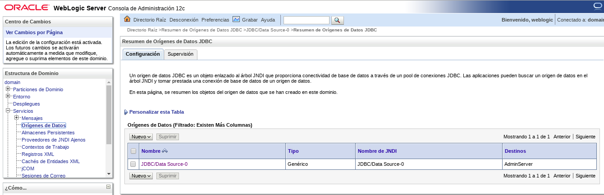
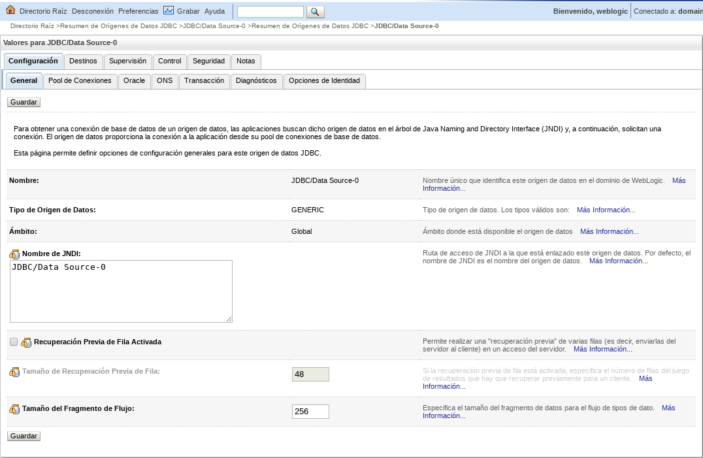
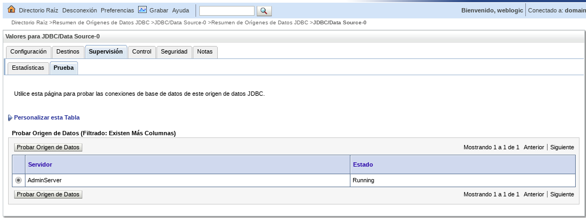
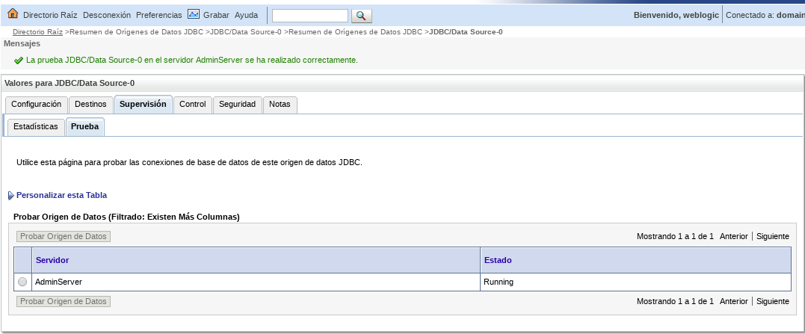

Probar un Datasource
====================

Seleccionamos Orígenes de Datos

Hacmos click sobre el origen de datos JDBC/Data Source-0

Seleccionamos el tab se supervision y luego en el tab de prueba, ahi seleccionamos el origen de datos.

Le damos Probar Origen de Datos y debemos ver en la parte superior La prueba JDBC/Data Source-0 en el servidor AdminServer se ha realizado correctamente.

